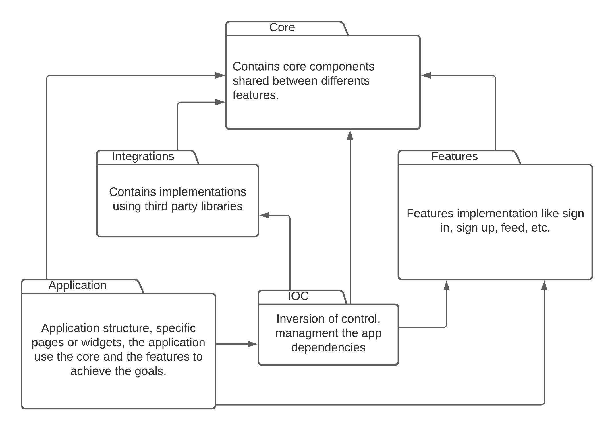
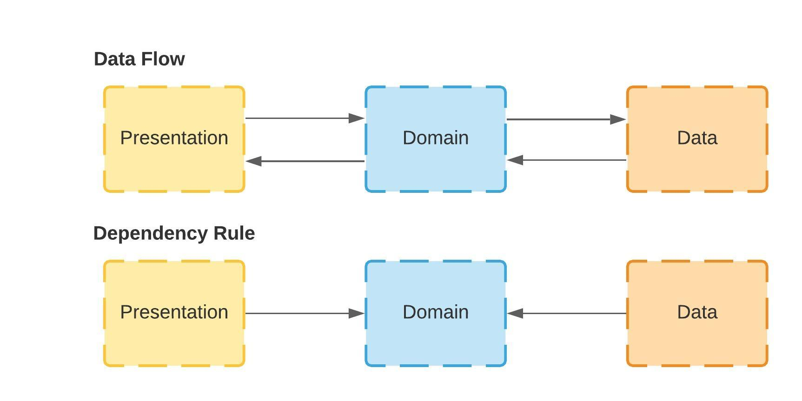
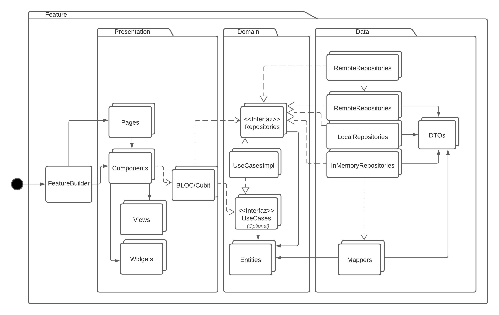

# Twitter App: Clean Architecture + Feature Toggles in Flutter

A small Twitter-like app that shows how to structure a Flutter project with Clean Architecture, one folder per feature, and feature toggles served by Firebase Remote Config. Every outside service (auth, database, logging, toggles) sits behind a port, so the whole UI also runs against an in-memory backend with no Firebase project at all.

**Companion to the Medium article: <add link>**

Status: sample project. Flutter 3.47.7 stable, Dart 3.13. Not a production app.

## Try it in 60 seconds

```sh
flutter pub get
flutter run -d chrome --dart-define=IN_MEMORY_BACKEND=true
```

Sign in with `demo@example.com` / `password`. The feed starts with three seeded tweets. Nothing is persisted; a restart resets everything.

## Features

Five screens:

| Route | Feature | What it does |
| --- | --- | --- |
| `/` | `auth` | Entry screen. Shows maintenance when `appIsActive` is off, then routes to home or sign-in depending on the session. |
| `/sign-in` | `sign_in` | Email + password form. Shows the sign-up button only when `signUpFeatureIsActive` is on. |
| `/sign-up` | `sign_up` | Creates an account. |
| `/home` | `home` | The feed (`tweet_feed`) with a like button per row (`tweet_like`) and a compose button shown only when `tweetCreationIsActive` is on. |
| `/tweet` | `tweet_creation` | Composes a tweet (280 chars) stamped with the signed-in user and the current time. |

Both English and Spanish copy ship in `assets/i18n/`.

## Architecture at a glance

The article's figures:





Dependency rule: `abstractions` <- `core` <- `features`. `integrations` implement `abstractions`. Only `ioc/` and `main.dart` import integrations. Only `integrations/` and `main.dart` import Firebase packages.

```
lib/
  main.dart                 Registers the injector, inits Firebase (unless in-memory), forwards uncaught errors to Logger
  src/
    abstractions/           Ports with no dependencies: AuthClient, DataRemoteClient, FeatureConfig, Injector, Logger, Failure
    integrations/           Adapters: firebase/, in_memory/, local/, get_it/, timeago/
    core/                   Shared domain and data: Tweet, User, UserSessionRepository, TweetDocument, RelativeTimeFormatter
    application/            App shell: MaterialApp, FeatureFlags, I18n, PageContainer, shared forms and views
    features/               One folder per feature, each with a <name>_feature.dart composition root
    ioc/                    IocManager: binds every port to an adapter per platform (mobile, web, in-memory)
assets/i18n/                en.json and es.json dictionaries
test/                       Mirrors lib/; shared fakes in test/support/; test/architecture/ enforces the dependency rule above
docs/                       Figures, development guide, architecture, ADRs
```

Full detail: [docs/architecture.md](docs/architecture.md).

## Add a feature

Example: a `profile` feature at `/profile`.

1. Create `lib/src/features/profile/` with `domain/`, `data/`, `presentation/` as needed.
2. In `domain/failures/profile_failure.dart`, declare `sealed class ProfileFailure extends Failure` and one subclass per outcome.
3. In `domain/repositories/profile_repository.dart`, declare the port the feature needs, returning `Future<Either<ProfileFailure, T>>`.
4. In `data/remote/profile_remote_repository.dart`, implement it on top of a port from `abstractions/` (for example `DataRemoteClient`). Map exceptions to failures there and log unexpected ones.
5. In `presentation/cubits/`, add `profile_state.dart` (a sealed state hierarchy) and `profile_cubit.dart`, which maps each failure to a state with an exhaustive `switch`.
6. In `presentation/pages/profile_page.dart`, build the screen with `BlocProvider` + `BlocConsumer` and `PageContainer`. Read copy through `I18n.of(context).translate(...)` and add the keys to both `assets/i18n/en.json` and `es.json`.
7. Create `profile_feature.dart` with `static const route`, `static generateRoutes()`, `static navigate(context)` and `buildPage()`. Resolve app-wide services from `Injector.instance` and build the repository, cubit and page there. Add `feature_readme.md`.
8. Register `...ProfileFeature.generateRoutes()` in `Application._routes()` and link to it from another feature by passing `ProfileFeature.navigate` or `ProfileFeature().build...()` as a callback or widget. Never import another feature's internals. If the feature is toggled, add a key to `FeatureFlags` and check it in the feature's entry widget.

## Docs

- [docs/development.md](docs/development.md): run, Firebase setup, checks, CI, what bites.
- [docs/architecture.md](docs/architecture.md): layers, ports, failures, toggles, i18n, testing.
- [docs/adr/](docs/adr/README.md): decisions and the alternatives considered.
- [CONTRIBUTING.md](CONTRIBUTING.md): branch flow and where knowledge lives.
- [CLAUDE.md](CLAUDE.md): where a coding agent starts; `AGENTS.md` points at it.
- [CHANGELOG.md](CHANGELOG.md).

## Known gaps

- Web with Firebase is not wired: a web run without the in-memory define stops with an `UnsupportedError` that explains what to do. It needs `flutterfire configure` and its options passed to `Firebase.initializeApp`.
- The Android build was not verified in this PR (no Android SDK on the machine that produced it).
