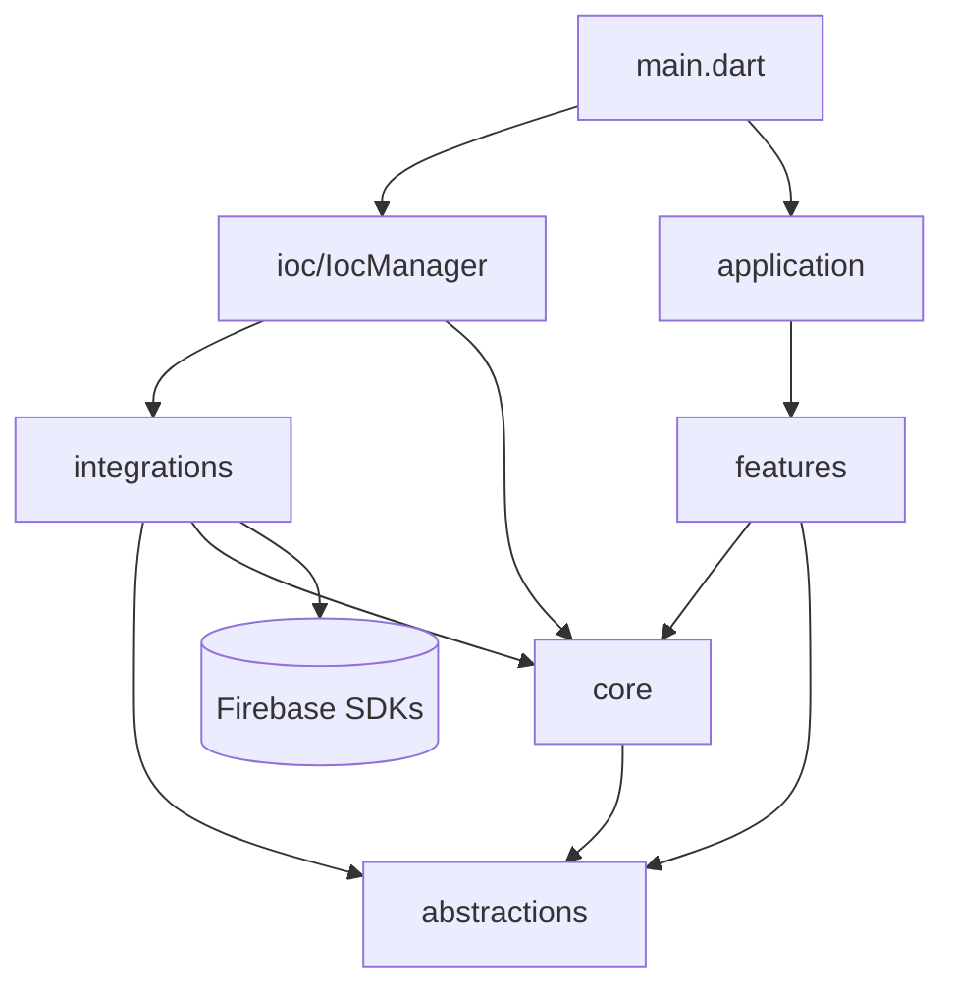
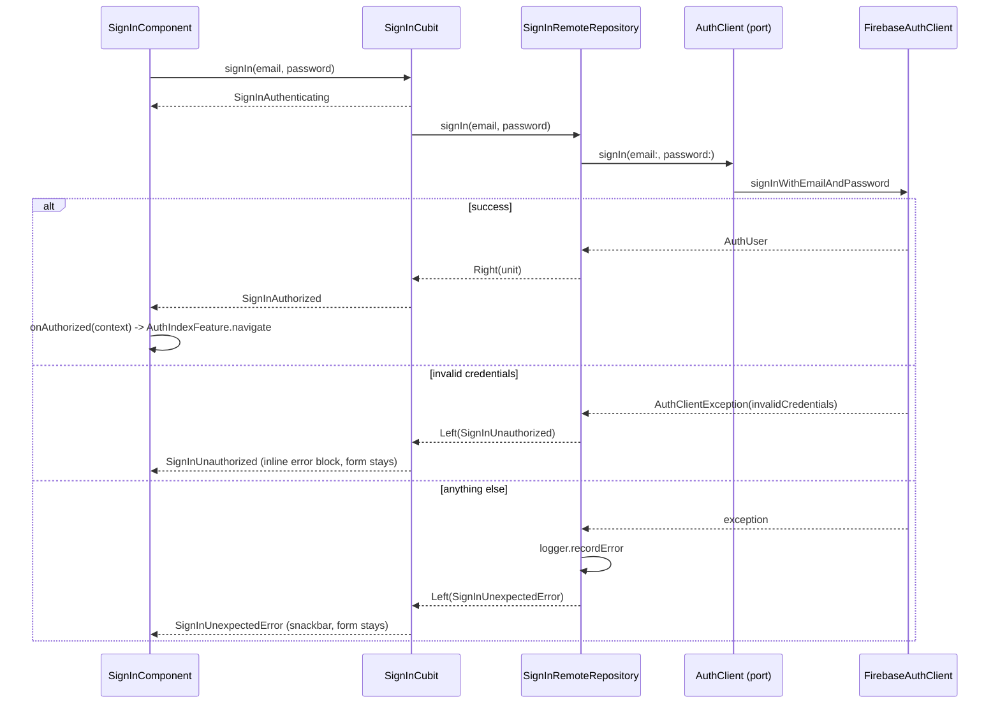

# Architecture

How the code is organised and why. Figures from the article: [components](1_app_components_diagram.jpeg), [data flow and dependency rule](2_data_flow_dependency_rule.jpeg), [anatomy of a feature](3_feature_diagram.jpeg). Decisions with their alternatives are in [adr/](adr/README.md).

## Layers and the dependency rule

Rules, all checked by reading imports:

- `abstractions` imports nothing from the app.
- `core` imports only `abstractions`.
- `features` import `abstractions`, `core` and `application`, never `integrations`.
- `integrations` implement `abstractions` (and reuse `core` types where an adapter needs them, for example `InMemorySeed` uses `TweetDocument`).
- Only `ioc/` and `main.dart` import `integrations`.
- Only `integrations/` and `main.dart` import Firebase packages.
- `application` is the app shell. It imports features to register their routes; features import its widgets, `FeatureFlags` and `I18n`.

## What lives where

| Folder | Contents |
| --- | --- |
| `lib/src/abstractions/` | Ports: `AuthClient` (+ `AuthErrorCode`, `AuthClientException`, `AuthUser`), `DataRemoteClient` (+ `RemoteDocument`), `FeatureConfig`, `Injector`, `Logger`, `Failure`. |
| `lib/src/integrations/` | Adapters: `firebase/` (`FirebaseAuthClient`, `FirebaseDataRemoteClient`, `FirebaseCrashlyticsLogger`, `FirebaseRemoteFeatureConfig`), `in_memory/` (`InMemoryAuthClient`, `InMemoryDataRemoteClient`, `InMemorySeed`), `local/` (`DeveloperLogLogger`, `DefaultsFeatureConfig`), `get_it/GetItInjector`, `timeago/TimeagoRelativeTimeFormatter`. |
| `lib/src/core/` | Shared domain and data: entities `Tweet`, `User`; ports `UserSessionRepository`, `RelativeTimeFormatter`; `TweetDocument` (the Firestore schema of a tweet, shared by the feature that writes tweets and the ones that read them); `AuthClientUserSessionRepository`. |
| `lib/src/application/` | `Application` (MaterialApp, routes, locales), `FeatureFlags`, `I18n` + `AppLocalizationsDelegate`, the design system (`theme/`: `AppTheme`, colour schemes, text theme, component themes, `tokens.dart`), `PageContainer`, and the shared widgets (`EmailPasswordForm` + validators, `FormErrorMessage`, `PillButton`, `InitialAvatar`, `HoverTint`, `CircularIndicator`, `MaintenanceView`, `MessageView`, `FeatureGate`, `showTranslatedSnackBar`). |
| `lib/src/features/<name>/` | `data/`, `domain/`, `presentation/` as needed, plus `<name>_feature.dart`. Each has a `feature_readme.md`. |
| `lib/src/ioc/ioc_manager.dart` | App-wide composition root. |

## Design system and page shell

The visual spec is [design/ux-pass-1.md](design/ux-pass-1.md) with its artboard; this section only says where it lives in code.

- `application/theme/` holds the tokens: explicit light and dark `ColorScheme`s (`tertiary` is the like accent and nothing else), the `TextTheme` on the platform font, the component themes (app bar, filled and text buttons, fields, FAB, snackbar, divider, progress indicator, icon button) and `tokens.dart` (`Space`, `Radii`, column widths, the tablet breakpoint). `AppTheme.light()` / `dark()` build the two `ThemeData`s `Application` passes. Widgets read everything through `Theme.of` and those constants; no colour, size or radius literal lives in feature code.
- `PageContainer` is the only widget that knows about the content column: it caps the body at `columnWidth` (600 by default, 400 for the auth forms), centres it with a fixed 16 gutter (or none, for lists that pad their rows), builds the app bar row (back or close leading, title, actions) aligned to that same column, and shifts the floating action button in so it floats inside the column at every width.
- Failures the user fixes by retyping are inline (`EmailPasswordForm.errorText` renders `FormErrorMessage` above the button); failures fixed by trying again, or that cannot be fixed, are snackbars or a `MessageView` with `Try again`. The table in the design doc lists each one.

## Composition roots: Feature classes and the Injector

There are two levels of wiring.

**App-wide**, in `IocManager.register()`. It registers one `GetItInjector` as `Injector.instance` and binds the services every feature shares:

- `Logger`, `FeatureConfig`, `AuthClient`, `DataRemoteClient`: lazy singletons, chosen per platform (next section).
- `UserSessionRepository`: a factory over `AuthClient`.
- `RelativeTimeFormatter`: lazy singleton (`timeago`).

**Per feature**, in `<Name>Feature`. The class resolves the app-wide services it needs from `Injector.instance` and builds everything else itself: repository, use case, cubit, page. Nothing feature-specific is registered in the injector. This keeps a feature's wiring in one file, next to the feature, and makes it obvious what the feature depends on.

A Feature class exposes only:

- `static const route` and `static generateRoutes()` for features with a screen.
- `static navigate(context)`.
- `buildPage()`, or `build()` / `buildButton()` / `buildFloatingButton()` for embeddable widgets.

Cross-feature wiring goes through those members only. `SignInFeature` passes `SignUpFeature().buildButton()` into its component as `signUpAction`. `AuthIndexFeature` passes `HomeFeature.navigate` and `SignInFeature.navigate` as callbacks. `TweetFeedFeature` passes `TweetLikeFeature().build` as `likeActionBuilder`. `HomeFeature` composes `TweetFeedFeature().build()` and `TweetCreationFeature().buildFloatingButton()`. A feature never imports another feature's internals.

## Ports and adapters

| Port (`abstractions/` or `core/`) | Firebase (Android, iOS) | In-memory |
| --- | --- | --- |
| `Logger` | `FirebaseCrashlyticsLogger` | `DeveloperLogLogger` |
| `FeatureConfig` | `FirebaseRemoteFeatureConfig` | `DefaultsFeatureConfig` |
| `AuthClient` | `FirebaseAuthClient` | `InMemoryAuthClient` |
| `DataRemoteClient` | `FirebaseDataRemoteClient` | `InMemoryDataRemoteClient` |
| `Injector` | `GetItInjector` | same |
| `UserSessionRepository` | `AuthClientUserSessionRepository` | same |
| `RelativeTimeFormatter` | `TimeagoRelativeTimeFormatter` | same |

Vendor types never cross a port. `AuthClient` throws `AuthClientException` with a vendor-neutral `AuthErrorCode`; `FirebaseAuthClient` maps Firebase codes to it. `DataRemoteClient` deals in collection names and `Map<String, dynamic>`; `RemoteDocument` carries the id and the data. Its `updateSet` adds and removes members of a set-valued field atomically (`FieldValue.arrayUnion` / `arrayRemove` in Firestore), which is how likes are written without lost updates.

### The backend switch

`IocManager.register()` picks the wiring in this order:

1. `IN_MEMORY_BACKEND=true` (a `bool.fromEnvironment` compile-time define): local logger and default flags, in-memory auth and data with `InMemorySeed`.
2. Otherwise Firebase: Crashlytics logger, Remote Config flags, Firebase auth and Firestore. On web this branch throws an `UnsupportedError` with instructions, because Firebase web options are not generated in this repo (see [development.md](development.md)).

`main.dart` registers the injector first, then forwards `FlutterError.onError` and `PlatformDispatcher.onError` to the `Logger`, then calls `Firebase.initializeApp()` unless in in-memory mode.

## Either and sealed failures

Every repository and use case returns `Future<Either<F, T>>` from `dartz`, with `F` a feature-specific `sealed class` extending `Failure`. When there is nothing to return on success, `T` is `Unit`. Streams (`TweetFeedRepository.watch()`) deliver errors on the stream instead.

The convention per feature:

- `domain/failures/<name>_failure.dart`: `sealed class XFailure extends Failure` and one `const` subclass per outcome the UI needs to distinguish (`SignInUnauthorized`, `SignInUnexpectedError`, ...).
- `data/remote/<name>_remote_repository.dart`: catches exceptions, maps the ones the UI cares about to a failure, logs the rest with `Logger.recordError` and returns the unexpected failure. Expected failures (wrong password, taken email) are not logged.
- `presentation/cubits/<name>_state.dart`: a sealed state hierarchy.
- `presentation/cubits/<name>_cubit.dart`: `result.fold(_stateFromFailure, (_) => SuccessState())`, where `_stateFromFailure` is an exhaustive `switch` over the failure type. Adding a failure subclass without handling it is a compile error.
- Widgets `switch` on the state in `builder` (what to draw) and `listener` (navigation, snackbars).

`TweetCreationCubit` is the exception: it carries the failure inside `TweetCreationFailed(failure)` and the page switches on it to pick the message.

States and failures are plain classes, not `freezed`. See [ADR 0002](adr/0002-either-and-sealed-failures.md).

## Feature toggles

Keys and defaults live in `FeatureFlags`:

| Key | Default | Checked in |
| --- | --- | --- |
| `appIsActive` | `true` | `AuthIndexCubit.check()`: off shows `MaintenanceView` before any session check. |
| `signUpFeatureIsActive` | `true` | `SignUpFeature.buildButton()` wraps `SignUpButton` in a `FeatureGate`. Off renders nothing. |
| `tweetCreationIsActive` | `true` | `HomeFeature.buildPage()` reads it once through `FeatureGate.builder`: on, it renders `TweetCreationFeature.buildFloatingButton()` and pads the feed by 88; off, no FAB and 16. |

A flag is checked once, at the feature's entry widget, through the `FeatureConfig` port. Nothing below the entry widget knows about toggles. The `/sign-up` and `/tweet` routes stay registered; only the way in is hidden. See [ADR 0003](adr/0003-remote-config-feature-toggles.md).

`FirebaseRemoteFeatureConfig` sets a 10 s fetch timeout and a 1 min minimum fetch interval, sets the defaults, then `fetchAndActivate()`. A failed fetch is logged and the defaults answer. `AuthIndexCubit` treats an exception from `FeatureConfig` as `AuthIndexUnexpectedError` with a retry button, so a broken flag source never leaves the entry screen on a spinner.

## I18n

Custom loader, no code generation ([ADR 0004](adr/0004-custom-i18n-loader.md)):

- Dictionaries: `assets/i18n/en.json` and `es.json`, nested JSON.
- `I18n.load(locale)` reads `assets/i18n/<languageCode>.json`; a missing file falls back to `en`.
- `I18n.of(context).translate('sign_in_feature.email_label')` resolves dotted keys. A missing key, or a key that points at a branch, returns the key itself, so the gap is visible in the UI and in tests.
- `AppLocalizationsDelegate` registers it in `MaterialApp`; `supportedLocales` comes from `I18n.languages` (`en`, `es`).
- Validators return keys (`form.email_required`), and the form translates them at render time.
- `test/application/localizations/i18n_test.dart` enforces key parity between languages, that every key used in `lib/` exists, and that every dictionary key is used.

Relative time strings come from `timeago` with locale `en`; the Spanish messages are registered but not selected. That is a known gap.

## Sign-in sequence

`SignInFeature` builds this chain: it resolves `AuthClient` and `Logger` from the injector, creates the repository and the cubit, and hands `AuthIndexFeature.navigate` to the component.

## Testing strategy per layer

| Layer | How | Examples |
| --- | --- | --- |
| Domain (entities, sorters, use cases) | Plain `test()` with hand-written fakes from `test/support/fakes.dart`. No Flutter, no network. | `tweet_test.dart`, `tweet_feed_sorters_test.dart`, `authored_tweet_creation_use_case_test.dart` |
| Data (repositories) | Run against the in-memory adapters, assert the `Either` and what was logged. | `sign_in_test.dart`, `sign_up_remote_repository_test.dart` |
| Presentation (cubits) | Fixed or controllable use cases and repositories; assert emitted states and subscription cleanup. | `auth_index_cubit_test.dart`, `tweet_feed_cubit_test.dart`, `tweet_like_cubit_test.dart` |
| Presentation (widgets) | `pumpLocalized` at 390x844 with the real dictionaries, in `en` and `es`. | `email_password_form_test.dart`, `tweet_feed_component_test.dart` |
| Integrations | In-memory adapters have their own tests. Firebase adapters are not unit-tested; they are thin and need a project. | `in_memory_data_remote_client_test.dart` |
| Application | I18n loader and dictionary consistency; validators. | `i18n_test.dart`, `email_validator_test.dart` |

Fakes implement the ports directly. Nothing is mocked with a framework.
